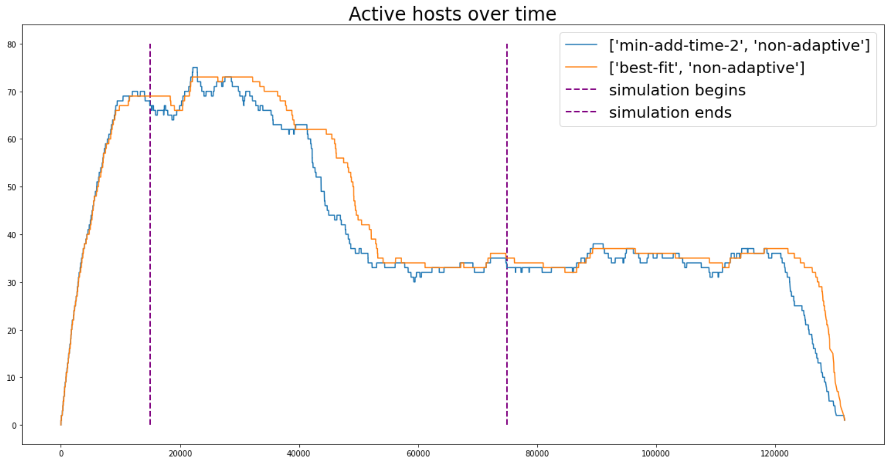
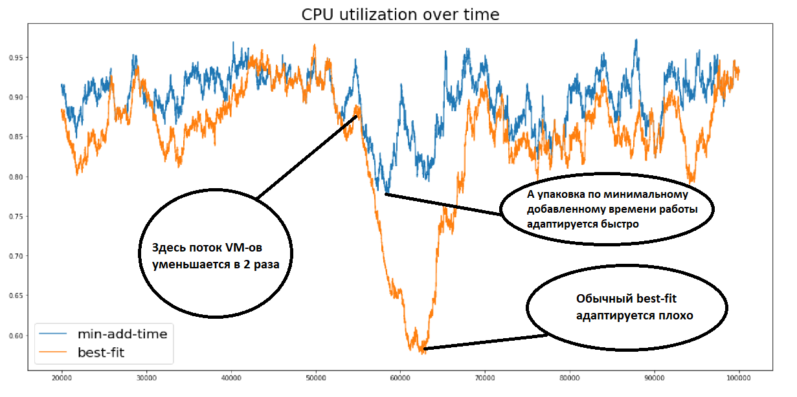
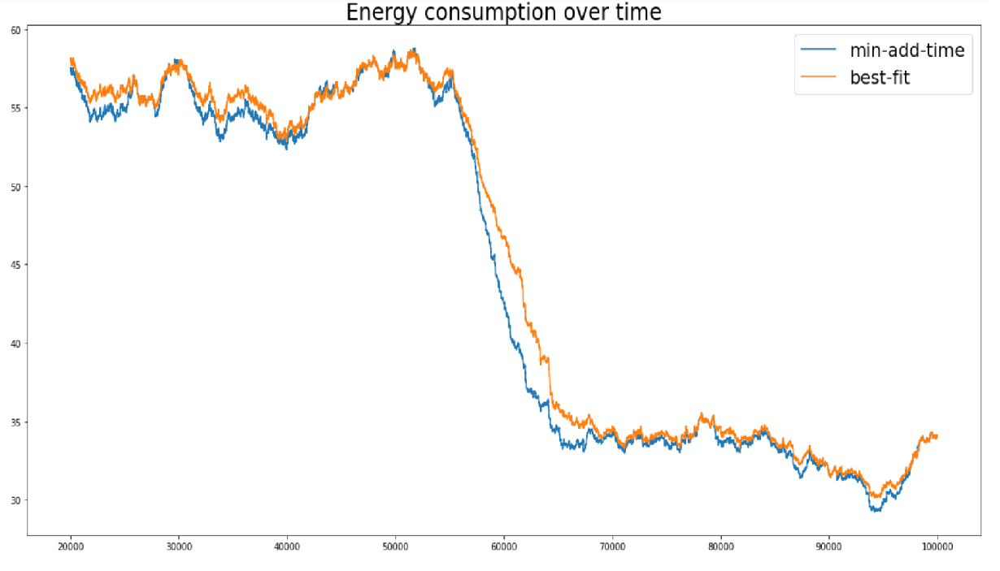
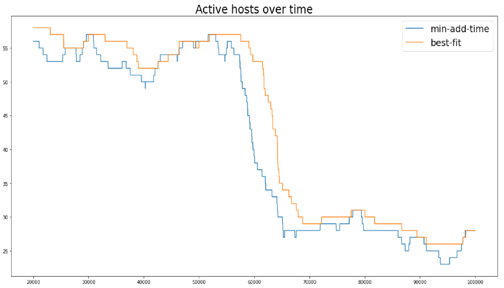

# Dynamic-VM-allocation

#### ========== 15.01.2020 ==========

### Новые алгоритмы для онлайн-планировщика

1) `Min-add-time-2`. Как и в случае оригинального `min-add-time`, сначала минимизируется то, насколько дольше проработает сервер при добавлении данной виртуальной машины на этот сервер. Затем, если нашлось несколько серверов, которые закончат свою работу позже новой виртуальной машины, т. е. предыдущая величина равна 0, то мы применяем не `best fit` как в оригинале, а выбираем тот сервер, которые закончит свою работу как можно раньше. Такая политика даёт возможность виртуальным машинам с коротким временем работы собираться на одних серверах, а с длинным временем работы - на других. В итоге, в случае падения нагрузки, балансировка происходит гораздо быстрее за счёт виртуальных машин с коротким временем работы.

2) `Min-add-time-3` - небольшая вариация предыдущего алгоритма. Здесь выбирается не один сервер с минимальным временем работы, а несколько первых минимумов. А уже из них выбирается наилучший при помощи `best-fit`. Этот алгоритм позволяет соблюдать баланс между двумя крайностями, хорошо работая при постоянной нагрузке, и в то же время балансируясь быстрее оригинала.

3) Теперь для каждой политики `best fit` минимизирует либо по загрузке одного ресурса, либо по нескольким сразу в зависимости от того, какие ресурсы потребляются сейчас больше всего. Так, если ресурс используется больше, чем на 90%, он считается приоритетным и учитывается при минимизации.

### Новые сценарии симуляции

Теперь все симуляции начинаются с полностью пустых серверов. Затем планировщик принимает некоторое количество виртуальных машин (сейчас их 8000), и работает до тех пор, пока последняя виртуальная машина не закончит свою работу. Таким образом, нагрузка на кластер сначала растёт от 0 до некоторой постоянной, затем происходит основная симуляция, а затем она падает до нуля (см. рисунок). При этом для подчётов используется сравнительно небольшой интервал, на котором происходит основное событие сценария.



Помимо сценария с резким понижением нагрузки добавлены два сценария на изменение соотношения потреблений CPU и RAM. Так, например, изначально частоты ВМ подобраны так, чтобы наиболее потребляемым ресурсом был процессор. Затем частоты перераспределяются так, чтобы уже потребление памяти было наиболее критичным. Таким образом, мы получили ещё один сценарий с адаптацией.

### Новая модель энергопотребления

`energy = min_active + (max_active - min_active) * (2u - u^1.4)`, где `min_active = 0.4`, `max_active = 1.0`, и `u` - потребление CPU. Таким образом, сейчас модель нелинейная, и если верить статьям, приближает реальное потребление немного лучше. Однако для дальнейшего прогресса, насколько я понимаю, необходимо знать реальные параметры железа, чтобы подобрать правильные коэффициенты.

### Другие изменения
- Добавлено распределение Пуассона для интервалов между запросами
- Немного повышена интенсивность запросов

#### ========== 20.12.2020 ==========

### Новый сценарий симуляции

Виртуальные машины продолжают приходить онлайн (по-одной), однако теперь каждому такому событию присвоено своё время. Так, между двумя соседними событиями прихода новой виртуальной машины проходит `t` единиц времени, где `t` выбирается равномерно на отрезке от 1 до `MAX_TIME_BETWEEN_EVENTS`. Таким образом при помощи последнего параметра можно изменять скорость потока приходящих виртуальных машин. Помимо времени попадания на сервер, для виртуальных машин задаётся время, в течение которого они будут работать. Соответственно, когда машина приходит на сервер, мы знаем время начала и конца её работы.

Теперь я решаю динамическую задачу, соответственно симуляция начинается с уже заполненными серверами и их загрузка либо остаётся постоянной или меняется согласно одному из выбранных сценариев. На данный момент на первой половине симуляции загрузка остаётся постоянной. Затем нагрузка резко падает в два раза (т. е. скорость прихода виртуальных машин становится меньше). Во время второй половины симуляции нагрузка так же остаётся неизменной. Таким образом, во время такой симуляции можно посмотреть, как различные алгоритмы справляются с постоянной нагрузкой, и насколько быстро они адаптируются к изменяющимся условиям.

Итоговая задача - минимизировать общее потребление энегрии кластером за время симуляции.

Ниже идут графики использования CPU, потребления энергии и числа активных хостов для двух алгоритмов. В качестве baseline-а используется (online) best-fit. Во втором случае я минимизирую то лишнее время, которое сервер будет дополнительно находиться в рабочем режиме, после добавления новой виртуальной машины. Иными словами, сначала я считаю для каждого сервера время `T_s`, когда все машины на нём прекратят работу. Затем я нахожу величину `VM_{end} - T_s > 0`, т. е. на сколько позже данная виртуальная машина завершит работу по сравнению с данным сервером, и минимизирую её. И, наконец, при прочих разных использую best-fit.

Данная техника позволяет системе быстро балансироваться при уменьшении нагрузки на облако, поскольку виртуальные машины с большими временами работы собираются на определённых серверах, соответственно остальные серверы быстрее освобождаются и переводятся в спящий режим. В то же время any-fit алгоритмы адаптируются гораздо медленее, поскольку никак не учитывают продолжительность времени работы виртуальных машин.







### Симуляции перенесены в jupyter (painter.ipynb)

#### ========== 29.11.2020 ==========

### Новые параметры симуляции
Новая симуляционная модель, теперь как виртуальные, так и физические машины имеют реалистичные параметры. В качестве примеров виртуальных машин я выбрал группу `General Computing-plus C6 ECS`, которые пакуются на серверы `General Computing S6_pro`.

Параметры виртуальных машин: https://www.huaweicloud.com/intl/en-us/product/ecs.html

Параметры хостов: https://www.huaweicloud.com/intl/en-us/pricing/index.html?tab=detail#/deh (bandwidth не нашёл, а потому поставил его 700 Gbit/s).

Главное достоинства выбора именно таких параметров заключается в том, что все три ресурса (CPU, RAM, bandwidth) потребляются примерно на одном уровне, потому решаемая задача решается 1-d подходами несколько хуже. Соответственно, понятна мотивация решать именно vector packing, а не обычный bin packing.

### Новые алгоритмы

http://ilanrcohen.droppages.com/pdfs/FracOnVBinPack.pdf

Для начала The f-restricted First Fit Algorithm. Небольшая модификация first fit, в которой запрещается делать корзины с большим дизбалансом. Пока стоит `f(x, y, z) = |max(x, y, z)| - |min(x, y, z)| < K`, но даже сейчас работает стабильно лучше обычного first fit или best fit.

Randomized Sliding Window Assignment - алгоритм с заумным выводом асимптотической оценки. Сам алгоритм работает, асимптотичесую оценку выполняет, но работает непозволительно плохо на фоне остальных подходов. Вообще этот пример показывает, что в bin packing теоретические статьи зачастую плохо связаны с практикой.

http://zhenxiao.com/papers/tpds2012.pdf

Minimizing skewness

Несмотря на то, что статья фокусируется на работе с дешевыми тарифами, там есть хорошая метрика skewness, т. е. отклонение потребления некоторого ресурса от среднего. Минимизация такого отклонения даёт возможность исключить дизбаланс в потреблении отдельных ресурсов. В 90% случаев работает лучше всего остального.

И, наконец, сравнение алгоритмов при заполнении датацентра 10000 виртуальными машинами:


#### ========== 22.11.2020 ==========
Добавлены 4 основные эвристики (next-fit, first-fit, best-fit, worst-fit). Доступна слеующая симуляция: генерируется 1000 реальных и 2000 виртуальных машин, виртуальные машины помещаются на серверы при помощи одной из эвристик (без миграций, по одной), считается потребление энергии, время работы, число задействованных хостов и т.д.

`generator.py` - генерирует .json файл с параметрами симуляции

`simulator.py` - собственно, сама симуляция

`python3 generator.py` - сгенерировать синтетические данные

Запустить симуляцию можно так:
```
  >>> python3 simulator.py next-fit 
  Total time: 0.006s
  Total cumulative energy: 4.505^+06
  Total hosts active: 857
  Total VMs allocated: 2000
  CPU global utilization: 0.67449
  RAM global utilization: 0.67566
```
Ещё есть варианты `first-fit`, `best-fit`, `worst-fit`
